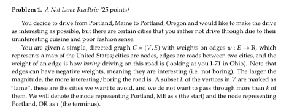
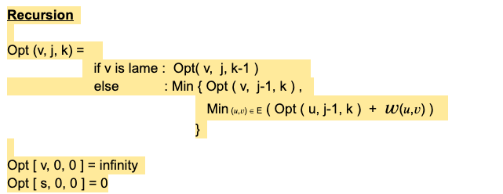

    
   
    
    
   
    
    FindPath(G, s, k):
        For v in V
        D[ v, 0, 0 ] = infinity
        P[ v, 0, 0 ] = null
    D[ s, 0, 0 ] = 0
    
    For h = 0 to k
        If (v == lame) : D [ v, j, k ] = D [ v, j, k-1]
        else:
        For j = 1 to n-1:
            For v in V:
                D [ v, j, k ] = D [ v, j-1, k]
                P [ v, j, k ] = P [ v, j-1, k]
        
                For each u ∈ [v’s InNeighbours] :
                    If ( D [ v, j-1, k ] + W(u,v) ) < D [ v, j, k ] :
                        D [ v, j, k ] = D [ v, j-1, k ] + W(u,v)
                        P [ v, j, k ] = u
