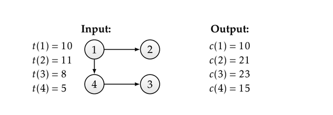

## Stage Craft

You’re in charge of assembling the stage for this year’s AlgoRhythms Music Festival (starring Master P). Assembling the stage in time will require careful planning. You are given:

A set V of n small tasks that are required to complete the stage.

A set E of pairs of tasks in V . A pair (u, v) is in E if task u must be completed before task v is started. There are no cycles in E.

For each task u ∈ V , the amount of time t(u) required for the task.

You have a very large team, so you can work on any number of tasks in parallel, but you cannot start a task u until all of the prerequisite tasks v have been completed.

Design an algorithm that takes as input the graph G = (V ,E) (represented as an adjacency list) and the time for each task, and outputs a list consisting of the earliest possible time that each task can be completed.

Input Format

First line consists of 'n', n denotes total tasks.

For each of the next 'n' lines:

Line u consists of a list, let's say 'L', of tasks where 1 <= length(L) <= (n-1). It denotes an edge from task u to each of tasks in list L i.e. (u, L[j]) for 1 <= j <= length(L).

If there are no edges from task u to any other tasks, Line u will simply have -1.

After the above input:

Next one line contains space-separated 'n' integers, where each ith integer represents t[i].
Note: Input will not have any self-loops or cyclic graph.

Constraints

    1 <= n <= 10500

    1 <= t[i] <= 10000, for 1 <= i <= n.

Output Format

Output 'n' lines, where each line represents earliest possible time that each task can be completed.

Sample Input 0

    4
    2 4
    -1
    -1
    3
    10 11 8 5

Sample Output 0

    10
    21
    23
    15

Explanation 0

