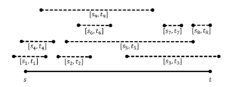

Big Ballers Club - Greedy Schedule 

As president of the Northeastern chapter of the Big Ballers Club, you need to staff a booth at thisyear ’s open house. The open house runs for the interval [s, t]. There are n volunteers, each of which is able to cover the booth for the interval[si, ti]. You need to select a set of volunteers S ⊆ {1, . . . , n} to cover the entire open house, meaning that ⋃(i) ∈ S  [ s(i), t(i) ] ⊇ [s, t]. Equivalently, for every time z ∈ [s, t], there is some volunteer i ∈ S such that z ∈ [si, ti]. Each member will be paid for their services, but ironically the Big Ballers Club has very limited funds, so you need to ensure |S| is as small as possible. You may assume that a solution exists (i.e.  that there is a set of volunteers S which cover the entire interval [s, t] ).In this problem you will design an efficient greedy algorithm that takes as input the numbers s, t, s1, t1, . . . , sn, tn and outputs a set S that covers the open house and uses the minimum number of staffers. The running time of your algorithm should be at most O(n^2). For 2 bonus points, design an algorithm which is o(n^2).The following is an example input with 9 volunteers. One optimal solution is S={1,3,9}.

